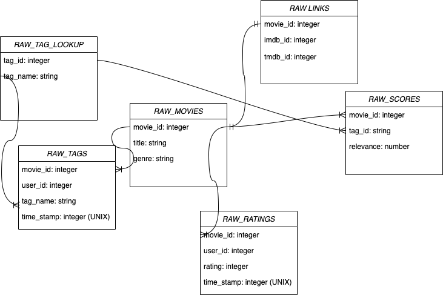

# Movie Review Data Engineering Pipeline
This project extracts raw data (.csv files) from an Amazon S3, using snowflake stage as the connection to the Snowflake database. A staging table is then created using this raw/stage connection.
Data Build Tool is then used to transform the data into a normalised schema.

## RAW Schema Entity-Relationship Diagram

## Raw Schema Breakdown
These are the raw tables built into snowflake, using a directly from the raw data stored in the Amazon S3 bucket (schema = RAW_MOVIE_TABLES). This connection was made using the AWS external stage connection with Snowflake.
Tables:
- RAW_LINKS = The raw table containing all the movies within the database as well as the links to movie review websites.
    - movie_id
    - imdb_id
    - tmdb_id
- RAW_MOVIES = This raw table contains all the movies within the database as well as metadata assigned to each movie.
    - movie_id
    - title
    - genres
- RAW_RATINGS = This table contains the rating assigned by a user to a movie along with the timestamp the rating was recorded on.
    - movie_id
    - user_id
    - rating
    - time_stamp
- RAW_SCORES = This table stores a relevance score assigned to how relevant a movie is to a specific tag.
    - movie_id
    - tag_id
    - relevance
- RAW_TAGS = This raw table stores a tag assigned by a user to a movie and the timestamp this assignment was made.
    - movie_id
    - user_id
    - tag_name
    - time_stamp
- RAW_TAG_LOOKUP = This raw table is a dimension table that assigns a key to tag.
    - tag_id
    - tag_name

## Changes Applied in the Staging Schema
There were a number of changes applied to raw tables in the staging schema (materialised as views), to ensure tests are passing within the `/netflix_snowflake_dbt/netflix_data/schema.yml` file.
The code for builing the staging views are located in the directory `/netflix_snowflake_dbt/netflix_data/models/staging`
- stg_links.sql = Duplicate movies are removed as well as movies with duplicated tmdb_id's.
- stg_movies.sql = Removing duplicate movies by selecting a distinct movie_id and title from the raw table.
- stg_ratings.sql = Casting the time_stamp column from a UNIX timestamp to a more human-readable LTZ timestamp.
- stg_tags.sql = Casting the time_stamp column from a UNIX timestamp to a more human-readable LTZ timestamp.

## Repository Breakdown
- /netflix_data = Data Build Tool (dbt-core) code.
- data_loading.sql = This worksheet creates, loads and tests the raw database tables build using the raw .csv files.
- external_data_stage_creation.sql = This worksheet creates a connection from the Amazon S3 bucket where the raw data is being stored to the database using IAM credentials.
- role_creation_definition = Creates the role to have full access to the Data Warehouse, where the data is housed. It also creates and defines the: a role, user for the role, the data warehouse, the database, the schema and assigns permissions to the role.

## Commands
### Database Refresh
These commands run database refresh for the specific schemas within the datawarehouse, that handle the refresh of data (e.g. added/updated records from the raw data source) alongside creating snapshots within the database
- Raw database tables :
- Staging tables :
```bash
cd neflix_data
dbt run --select /models/staging/
```
- Dimension and Fact Tables
```bash
cd neflix_data
dbt run --select /models/dim/
```
and 
```bash
cd neflix_data
dbt run --select /models/fct/
```
### Database testing
This commands runs the tests of the staging table views (located). Checking if that the raw data tables have been transformed correctly so that the dimension and fact tables are build correctly from the staging tables.
```bash
cd neflix_data
dbt test```